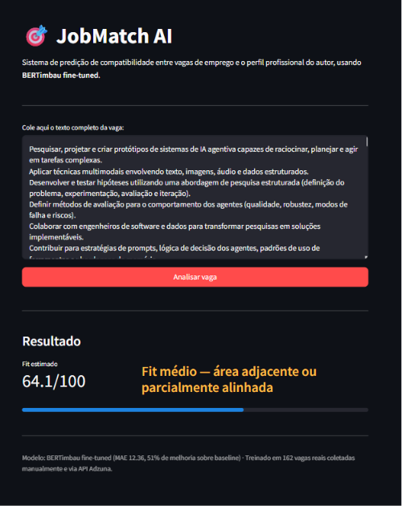
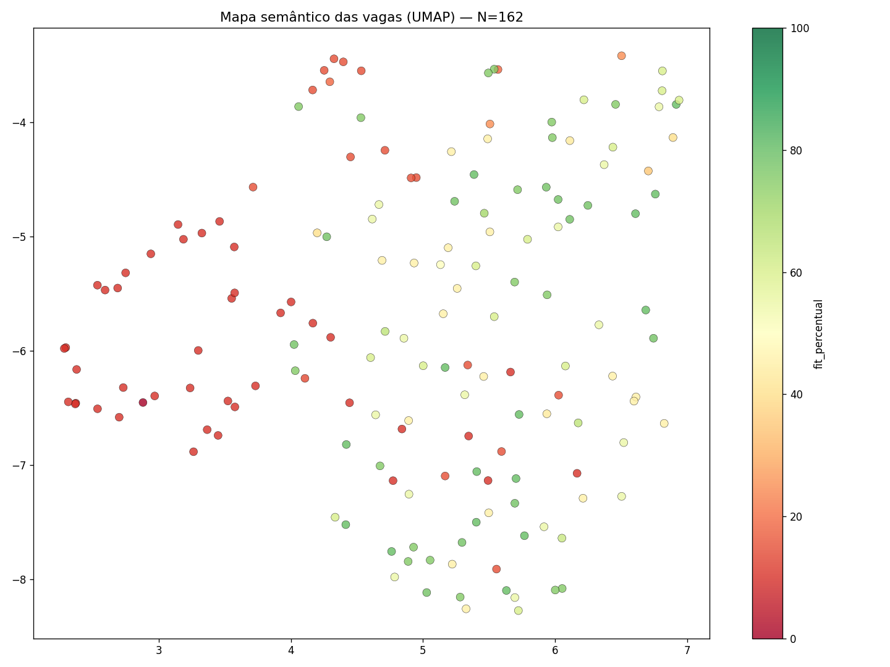

# 🧠 JobMatch AI — matching vaga × perfil com BERTimbau

Modelo de NLP que lê a descrição de uma vaga em português e prevê um **fit de 0 a 100** com o meu perfil profissional.
Nasceu da minha própria busca por uma vaga júnior em Ciência de Dados: em vez de ler centenas de vagas, treinei um modelo para priorizá-las.



## Resultado

Avaliado em 33 vagas de validação que o modelo não viu no treino:

| Métrica | Baseline (média do treino) | BERTimbau fine-tuned | Melhoria |
|---|---|---|---|
| MAE | 25,22 | **12,36** | −51,0% |
| RMSE | 27,62 | **15,61** | −43,5% |

Na prática, o modelo erra o fit em cerca de 12 pontos, em média, contra 25 de um chute pela média.

## Como foi feito

| Etapa | Notebook | O que acontece |
|---|---|---|
| 1. Dados e EDA | `01_EDA_JobMatchAI.ipynb` | 162 vagas reais (15 coletadas à mão + 147 via API Adzuna), limpeza e análise da distribuição do fit |
| 2. Tokenização | `02_Tokenizacao_BERTimbau.ipynb` | Validação do limite de tokens: todas as vagas cabem em 512 tokens; só 0,81% de tokens `[UNK]` |
| 3. Embeddings | `03_Embeddings_Similaridade.ipynb` | Embeddings semânticos e mapas em PCA/UMAP: vagas técnicas e não técnicas se separam bem |
| 4. Fine-tuning | `04_Fine_tuning_do_BERTimbau.ipynb` | BERTimbau com cabeça de regressão, 4 épocas, GPU T4 (Colab), comparação com baseline |
| 5. Recomendação | `05_Sistema_de_Recomendação.ipynb` | Função `prever_fit()` que ranqueia vagas novas |
| 6. Aplicação | `app/` | API FastAPI (`POST /prever-fit`) + interface Streamlit |



## Limitações (e o que eu faria a seguir)

- **Dataset pequeno (162 vagas):** é uma prova de conceito com metodologia correta, não um modelo para produção. Próximo passo: ampliar a base e usar validação cruzada.
- **Regressão à média:** o modelo acerta bem o meio da escala e subestima os extremos (vagas muito boas ou muito ruins).
- **Senioridade:** o modelo tem dificuldade em diferenciar júnior de pleno dentro da mesma área técnica.
- **Texto truncado:** a API Adzuna corta as descrições em cerca de 500 caracteres.

## Como rodar

```bash
git clone https://github.com/edudatalytics/jobmatch-ai.git
cd jobmatch-ai
pip install -r app/requirements.txt
```

O modelo treinado (~500 MB) não está no repositório. Para gerá-lo, rode os notebooks 01 a 04 no Google Colab, em ordem; o notebook 04 salva o modelo em `models/bertimbau_fit_v1/`. Depois:

```bash
uvicorn app.main:app --reload          # terminal 1 — API em http://localhost:8000/docs
streamlit run app/streamlit_app.py     # terminal 2 — interface
```

## Estrutura

```
jobmatch-ai/
├── app/
│   ├── main.py               # API FastAPI
│   ├── streamlit_app.py      # interface
│   └── requirements.txt
├── data/
│   └── vagas_clean_v2.csv    # 162 vagas rotuladas
├── notebooks/                # 01 → 05, na ordem do pipeline
└── models/                   # gerado localmente (não versionado)
```

## Stack

Python · Pandas · Hugging Face Transformers (BERTimbau) · Sentence-Transformers · PyTorch · Scikit-learn · UMAP · FastAPI · Streamlit · Google Colab

---

**Eduardo Matos** · [LinkedIn](https://www.linkedin.com/in/matos-eduardo) · [GitHub](https://github.com/edudatalytics)
